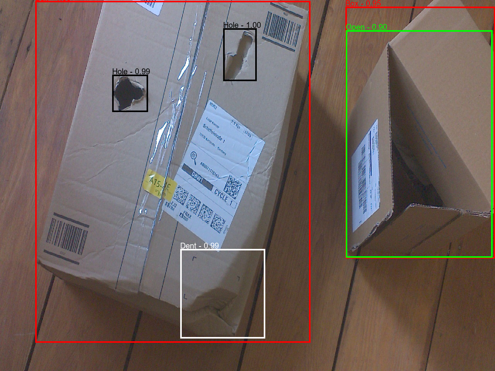

# Pandemic Package: Detect Damaged Packages with a Jetson Nano :book:

Welcome to the repository of our group "Pandemic Package", a project in the course *Artificial Intelligence in Service Systems - Applications in Computer Vision* that took place during the summer term 2021 at Karlsruhe Institute of Technology. This repository includes an object detection application for damages of packages based on state-of-the-art object detection frameworks. It is geared towards deployment on a Jetson Nano for on-edge inference.

## Documentation
The ReadMe files do not belong to our Documentation. We used Sphinx for a detailed documentation of our project, the system and the code itself. 
Please follow these steps to view the documentation as html files on your local machine :
1.  Clone this Repo
2.  Open the [index](docs/build/html/index.html) with a browser of your choice. 

Alternatively, you can download a PDF version of the documentation [here](https://github.com/jo-jstrm/Damaged-Package-Detection/blob/main/docs/AISS-CV.pdf).

## Final Presentation
Our final presentation is stored in the docs folder.

## Data
All images and annotations are stored in [BwCloud](https://bwsyncandshare.kit.edu/s/s5Yr4QQrCEfdigo).

## Tutorials for Users & Developers
Moved [here](Developer_Tutorials.md)

## License
We use the MIT license, find it [here](https://github.com/jo-jstrm/Damaged-Package-Detection/blob/main/LICENSE).
