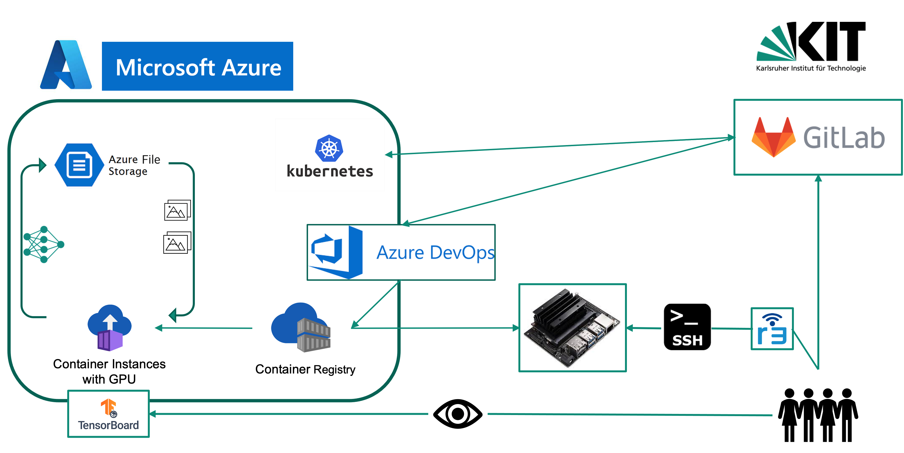

.. _arch_overview_reference:

Architecture Overview
=====================
*Created by Joel Oswald*

In order to build a robust system, we used state-of-the-art DevOps to build a scalable system that can easily be adapted to changing demands. This section covers the technology infrastructure we used throughout the project. We first describe our CI/CD workflow, followed by the setup of the Jetson and the cloud-based services.

.. toctree::   
   :caption: Architecture Components
   :maxdepth: 2

   ci
   jetson
   azure
