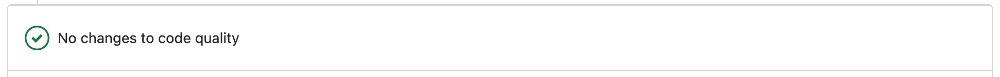
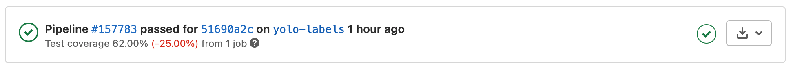

.. _ci_reference:

================
CI/CD Pipelines
================

*Written by Joel Oswald*

To support our developers, we built multiple CI pipelines that automatically take care of important checks and prepare the cloud training environment.

GitLab Pipelines
----------------

GitLab offers many possibilities to easily integrate basic CI pipelines with little effort.
In order to run those pipelines we setup a Kubernetes cluster in Azure that hosts the GitLab workers (*Runners* in the GitLabs namespace).
The pipelines can be conveniently specified in a `yaml file <https://git.scc.kit.edu/ukojp/aiss-cv/-/blob/master/.gitlab-ci.yml>`_.

Code Quality 
#############

The "Code Quality Pipeline" checks the readability and best practices (based on PEP) for each merge request and informs the developer whether the code quality degraded on some points, e.g., by too many nested loops or function arguments. By means of this pipeline each developer gains immediate insight into the overall quality of the submitted code.

Coverage 
########

The "Coverage Pipeline" performs our :ref:`unit tests <test_reference>` and calculates the percentage of code that is covered by the tests. 
For each merge request it informs about the change in coverage, so that tests can be added if the coverage decreases.

Overall, those pipelines help the developer as well as the asignee of the merge request decide on the quality of the submitted code. Hence, they pose a valuable support in maintaining such a large code repository.

Azure Pipeline
--------------

In addition to GitLab's own pipelines we utilized `Azure Pipelines <https://azure.microsoft.com/en-us/services/devops/pipelines/>`_, which allow executing the tests script. If the test succeed, the Azure pipeline rebuilds the Docker images and pushes them to a container registry. These Docker images are then used for training the models with sophisticated GPUs. Azure offers accounts for students allowing usage free of charge. 

The GitLab repository is not public. Therefore, in order to allow the Azure pipelines to access the repository without the need to hard-core login credentials, we created an API access token for GitLab, which can be revoked at any time.
This token is securely stored in a vault as a key-value pair and can be accessed by the Azure pipelines. Each pipeline is automatically triggered on new pushes to the master branch of the code repository. 
