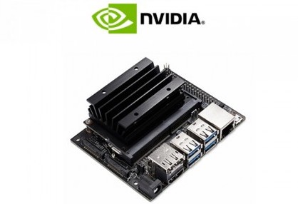
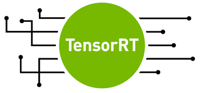

Jetson
=======

*Written by Joel Oswald*

|img0|  [#]_

In this section we describe how the Jetson Nano is used, accessed and set up for optimal performance during the project.
The NVIDIA Jetson Nano [1]_ is a powerful embedded device for running neural network inference.
Since it runs an Ubuntu-derivative on the arm64 architecture, it is able to execute all cloud-trained models directly on the jetson itself. 

However, in order to completely leverage the Jetson's capabilities it is necessary to adjust and convert the trained models into an optimized format and execute that on the Jetson instead of the model's original framework.
In this regard, the highest performance can be expected when using NVIDIA's proprietary *TensorRT* library.

The Hardware
-------------

We got the Jetson shipped with all necessary hardware components (i.e., case, charger) and an additional camera module that can be attached to the board.
During the project, the Jetson was placed with the camera facing packages, so that every developer had the chance to test models and program logic whenever necessary. 

.. image:: ../../img/jetson_setup.png
    :width: 100%

Access for the Team
-------------------

In order to allow every team member to access the Jetson remotely, we set it up as an IoT-Device at `remote.it <remote.it>`_. With this method, each team member was able to access the device via a secure ssh connection. 
We used X11-forwarding to pass windows containing live-inference results to the local machine of the developer.

Software Deployment
-------------------

Since regular updates at the edge-systems are expected, we required a solution that allows updating code without any end user interaction.
A *systemd* service on the Jetson can continuously check for new docker images in our Azure container registry and pulls as well as starts the image when a new image is found.

.. _sec:jetson-deployment:

Model Deployment
----------------

|img2| |img1| [#]_ [#]_

As mentioned above, some work is necessary to optimize the machine learning models for the Jetson. 
We decided to use NVIDIA TensorRT, because we expected highest performance and good usability from it. 
We strongly relied on the code of  `jkjungs Github Repo <https://github.com/jkjung-avt/tensorrt_demos>`_ that already provides much of the necessary code.

We used TensorRT for the YOLO models (see :ref:`sec:yolo-models`) first. In order to convert the Darknet models to TensorRT, we first converted them to the *Open Neural Network Exchange* (ONNX) format. 
In a second step, we used the ONNX parser of the TensorRT library to convert the model into the TensorRT format. 
Using this procedure we are able to run a YOLO model at 27 fps on the Jetson. Without the optimization, i.e., using the Darknet YOLO model, the same model runs with 5 fps.

For the deployment of the Tensorflow model there were different options. We used the TensorRT binding in Tenosrflow (*TF-TRT*) to optimize subgraphs of the model. 
With this method, the actual inference still uses the Tensorflow framework with GPU support.

The main inference file is the `control_loop <https://git.scc.kit.edu/ukojp/aiss-cv/-/blob/Inference/aisscv/inference/control_loop.py>`_, which continuously grabs images from the camera and runs the detection model on top of it. 
The control loop is model-agnostic, so there is no need to change any code to switch between the YOLO-TensorRT model and the Tensorflow detection models. The model that is to be used can be passed as a command line argument. This is possible due to our polymorphic approach, which implements a parent model-class from which all our models must inherit.

As a prototype we have implemented a simple user warning message via an app-notification. We used `Pushbullet <https://www.pushbullet.com/>`_, because it has free applications for iOS and android.
Once a damage is noticed, we send the current image with a warning message via Pushbullet's API.
Afterwards, a cool-down phase starts, so that the user will not get multiple warnings for the same damage. 

.. [1] For brevity, we will omit the *Nano* when referring to the Jetson Nano.

.. rubric:: Image Sources

.. [#] https://static.generation-robots.com/15689-product_cover/nvidia-nano-development-kit.jpg

.. [#] https://developer-blogs.nvidia.com/wp-content/uploads/2018/11/NV_TensorRT_Visual_2C_RGB-625x625-1.png

.. [#] https://tse3.mm.bing.net/th?id=OIP.7q4Fbq0xfq7TuPy-NZERbQHaB5&pid=Api