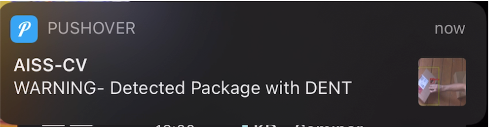
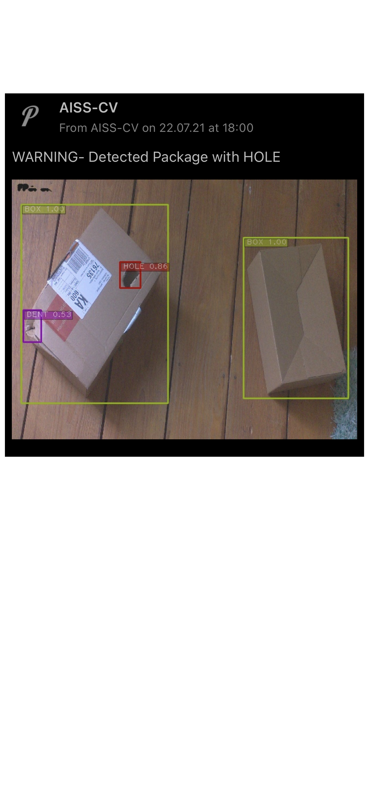

Subsequent Damage Handling
==========================

*Written by* Alexey Rosenberg *and* Joel Oswald

This section covers the business logic of the prototype, including the results created by software from the model's inference, the tools used and the output shown to the user. 

Description of Business Logic in the Software
---------------------------------------------

The goal of the software is to inform the user, when a package with damages is detected by the system.
Therefore, a user should receive a notification only if a package is detected and it has at least one damage.

The main work is done in the control_loop.py. In this while-loop, the chosen model is called via it's unified interface and the returned boxes are threshholded. 
If one or more damage classes are present in the clss list, this is remembered to be confirmed in the next cycles.
A counter and an if-clause check, if damges are present in at least three consequetive inferences.

.. highlight:: python
.. code-block:: python
    :linenos:

    if confirm_cycles >= 3:

If this is the case, the if-clause is entered and a new thread with the notify-method for user notification created with the following command. 
The labeled image with the damaged package is given as argument.

.. highlight:: python
.. code-block:: python
    :linenos:

    threading.Thread(target=notify, args=(img, cls_dict[damage])).start()

In the notify-method, the `Pushover API <https://pushover.net/api#attachments>`_ is called to create a notification with a message including the identified damages and the labeled image. 
“token” and “user” serves as unique identification for correct user detection by Pushover. The “files=” creates the image attachment.

.. highlight:: python
.. code-block:: python
    :linenos:

    r = requests.post("https://api.pushover.net/1/messages.json", 
		 data={"token": "azfjvmj5p96sydm337nqsezsc3ts5h", "user": "urjgtk3d1o6yp9sv5ngi2zg1ooo6pn", "message": "WARNING- Detected Package with {}".format(damage) },
		 files={ "attachment": ("image.jpg", cv2.imencode('.jpeg', img)[1].tobytes(), "image/jpeg")

Afterwards, a cool-down phase is activated, during which the system won't notify the user again, as it is likely still the same damage. 

Examples of Results
-------------------

The user receives a push notification on a phone or other mobile device with the message and attachment created earlier.
In the figure 4.5 below an example user notification with a damged package is shown. 

    Example of a preview notification

	