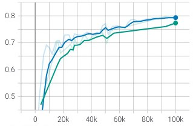

Tensorflow Object Detection API
===============================

*Written by Bolatito Zäch*

In this chapter, the steps necessary to create a model with the TensorFlow 2 Object Detection API are explained. For the next steps to work as intended, make sure that the base folder of this repository is your current working directory. 
To download the Tensorflow Object Detection API, use the command

.. code-block:: bash
    :linenos:

	$git submodule update --init --recursive 

The API can now be found in the folder :code:`./tf-models`.

The first step is to create the container image from the provided dockerfile. This is done by running

.. code-block:: bash
    :linenos:

	$docker build -f Dockerfile.tftrain -t tg-train-image

After the successful creation of the container, it needs to be started.

.. code-block:: bash
    :linenos:

	$docker run -it -v $(pwd):/home/app -p 6010:6010 --name tf-training tf-train-image

This container runs as CPU-only. To enable GPU-support, follow the `instructions <https://www.tensorflow.org/install/docker>`_ and modify the commands accordingly.
For Windows users :code:`$(pwd)` needs to be changed to :code:`${pwd}`. If the path contains any whitespaces, the respective sections need to be enclosed in quotation marks.

Preperation
###########

Before the training can start Tensorflow requires a label map. This is a file that maps each of the used labels to an integer value. The file should have the extension :code:`.pbtxt`.
For our example with a total of five classes the label map looks like the following:

.. code-block::
    :linenos:

	
    item {
        id: 1
        name: 'box'
    }

    item {
        id: 2
        name: 'wet'
    }

    item {
        id: 3
        name: 'dent'
    }

    item {
        id: 4
        name: 'hole'
    }

    item {
        id: 5
        name: 'open'
    }

The label map should be saved in the annotations folder with the annotations of the images.

The last preparation step is to convert the annotations and images into the TFRecord format. If a training/test split is used, a TFRecord file needs to be created for each. Run the following command to create the file:

.. code-block:: bash
    :linenos:

    $python aisscv/utils/pascal_voc_to_tfrecord.py -x data/annotations/ -i data/images -l data/annotations/label_map.pbtxt -o data/all_data.record

Training
########

We mainly used an SSD with a MobileNetv2 as backbone from the TensorFlow model zoo, but the following steps should also work with all models of the zoo. 
The Tensorflow Object Detection API completely abstracts from the actual python/C++ code and allows to specify the entire model and its hyperparameters via a pipeline configuration. 
The configuration file is usually called "pipeline.config" and comes with the pretrained models of Tensorflow's model zoo. We saved the pipelines that were of interest for us at  "./models/CHOOSEN_MODEL/pipeline.config".
Key parameters that should be adjusted are:

- paths to the label_map, training set and evaluation set
- :code:`num_classes`: Set to the number of different label classes
- :code:`batch_size`: Increase or decrease depending on available memory
- :code:`lable_map_path`: Path to label map
- :code:`num_steps`: Number of steps used to train the model
- :code:`num_steps`: Number of steps used to train the model

To start an exemplary training run

.. code-block:: bash
    :linenos:

    $python tf-models/research/object_detection/model_main_tf2.py --model_dir=./models/finetuned --pipeline_config_path=./models/ssd_mobilenet_v2_fpnlite_320x320_coco17_tpu-8/pipeline.config --alsologtostderr

If there are still memory problems, the parameters :code:`queue_capacity` and :code:`min_after_dequeue` can be decreased to reduce memory consumption.

We worked with different (SSD-based) architectures and experimented with different hyperparameters.
Our final model training was conducted using the following hyperparameters:

- Batch size = 32 was chosen to balance memory consumption and training time.
- Number of steps = 100000
- Base learning rate = 0.08
- We used a momentum optimizer, with a warm up phase and a decaying learning rate. The warm up phase starts with a learning rate of 0.03 and lasts 1000 steps. The rate of decay depends on the number of totals steps.
- Other hyperparameters were not changed. 

Evaluation
##########

If the data is split into a train and a test set, the training process can be evaluated in real time with Tensorboard. 

Run the following command in a new terminal:

.. code-block:: bash
    :linenos:

    $python tf-models/research/object_detection/model_main_tf2.py --model_dir=./models/PATH_TO_MODEL --pipeline_config_path=./models/ssd_mobilenet_v2_fpnlite_320x320_coco17_tpu-8/pipeline.config --alsologtostderr --checkpoint_dir=models/PATH_TO_CHECKPOINT

The SSD with a MobileNetv2 backbone reached a mAP of `79\%`. The Model with a ResNet backbone performed slightly worse in all metrics.

    The blue line indicates the mAP of the Model with a MobileNetv2 backbone and the green line of the Model with a ResNet backbone. 

The simultaneous evaluation requires additional memory. This should be considered when determining the memory requirements during the creation of the container. Alternatively, the evaluation can be started from a second container that has access to the volume where the checkpoints are saved. 