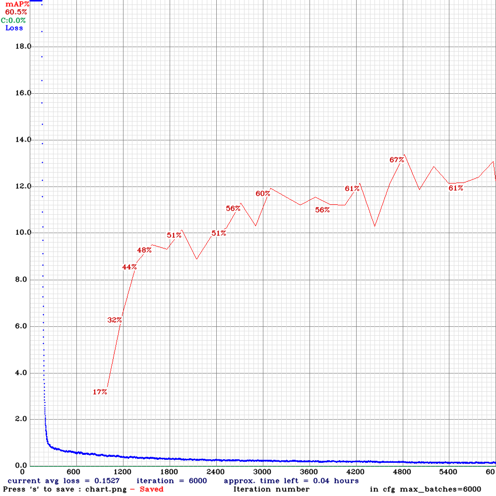

YOLO and Darknet
================

*Written by Johannes Jestram*

As YOLOv4 reaches state-of-the-art performance in object detection tasks, we decided on trying it out for our use case.
The original YOLO uses its own library, `Darknet <https://github.com/AlexeyAB/darknet>`_. Implementations in other frameworks, such as Tensorflow and TensorRT (for inference only), exist. Due to the constrained hardware of the Jetson Nano, we chose to use the `optimized TensorRT implementation from jkjung <https://github.com/jkjung-avt/tensorrt_demos/>`_ for inference on the Jetson. However, this version is only for inference, so in addition we set up a Docker container with the Darknet-YOLOv4 for training [#]_.

Installation
------------

Due to its C heritage, Darknet is not as convenient to install as other frameworks such as PyTorch and Tensorflow. Having installed the `requirements <https://github.com/AlexeyAB/darknet#requirements-for-windows-linux-and-macos>`_, the workflow on Ubuntu 18.04 with a NVIDIA GPU, cuDNN 8.1, and CUDA 11.3 is the following:

.. code-block:: bash
    :linenos:

    $git clone https://github.com/AlexeyAB/darknet.git
    $cd darknet
    $sed -i "s|GPU=0|GPU=1|g" Makefile
    $sed -i "s|CUDNN=0|CUDNN=1|g" Makefile
    
If the GPU supports half-precision floats, also

.. code-block:: bash
    :linenos:

    $sed -i "s|CUDNN_HALF=0|CUDNN_HALF=1|g" Makefile

In order to do video inference and MJPEG streaming of the training progress (accessible via browser)

.. code-block:: bash
    :linenos:

    $sed -i "s|OPENCV=0|OPENCV=1|g" Makefile

Finally, compile Darknet with

.. code-block:: bash
    :linenos:

    $make

Training Configuration
----------------------

In order to train YOLO for a custom object detection task, several configuration files are required. Setting up those files requires changes depending on the number of classes and the setup of the training-machine. The configuration files consist of:

- :code:`model.cfg` stores the model architecture, which consists of the specification of the layers, input-image size, and hyper-parameters for training. In order to work for a custom detection task, the number of filters in several convolution layers and the number of classes the yolo-layers must be changed.
- :code:`train.data` contains the paths to :code:`class.names`, :code:`train.txt`, :code:`validation.txt`, the number of classes, and the path for storing intermediate weights during training.

    - :code:`class.names` stores all class names for the object detection task.
    - :code:`train.txt` contains the path to each training image.
    - :code:`validation.txt` contains the path to all validation images. `According to the author <https://www.ccoderun.ca/programming/darknet_faq/#train_and_valid>`_, you can place all training images here as well without negatively affecting the training.
    
- :code:`yolov4.conv.137` and :code:`yolov4-tiny.conv.29` contain pre-trained weights, so that we did not have to start training from scratch. This means, we only needed data to fine-tune the model, and not train it from scratch. The models are pre-trained on the MS COCO dataset.

Updating Labels
---------------

YOLO uses a custom format for its image annotations. Therefore, we created a script :py:mod:`utils.pascal_voc_to_yolo` that converts Pascal VOC labels to YOLO labels. Further, because the paths to the images in :code:`train.txt` change every time the images are moved, we added a function to the script that can change the paths given in :code:`train.txt`.

Local Training
--------------

With the prepared configuration files and updated labels, the command for training YOLO is 

.. code-block:: bash
    :linenos:

    $cd darknet
    $./darknet detector train path/to/train.data path/to/model.cfg path/to/yolov4.conv.137 -map

The flag :code:`-map` is used for plotting the mean average precision (mAP). Because the training command includes the absolute paths to the required files, and :code:`train.data` contains the absolute paths to all other files, it seems natural to place them all in the same folder outside of Darknet. This also helps with mounting the complete training configuration as a volume to the Docker container.

The following image shows the output during training. The chart opens as a separate window and continuously shows the training progress. 

    The red line indicates the mAP. It requires the :code:`-map` flag to be set, as well as validation data to be provided.

For the training we used the following hyperparameters:

- Default learning rate = 0.00261
- Default momentum = 0.9
- Default weight decay = 0.0005
- Random=1 changes the image resolution randomly during training in order to improve model quality
- Subdivisions = 64 is higher than the default and therefore creates more, smaller batches. This is mainly determined by the GPU performance.
- There are other hyperparameters that we did not change.

Training with Docker
--------------------

The non-trivial installation of Darknet was an issue in the beginning, because not everyone could run and train YOLO. Therefore, for increased portability, we set up Docker containers for both local training and training on Azure (see :ref:`sec:azure`). Using the container for local training only requires a NVIDIA GPU and corresponding driver, as well as `nvidia-docker <https://github.com/NVIDIA/nvidia-docker>`_ installed. The training data and configuration of YOLO is loaded via a Docker volume. With this setup, the user can start the container on the local computer with

.. code-block:: bash
    :linenos:
    
    nvidia-docker run -it -p 8888:8888 -v ~/yolo-data:/training-data 74797469/yolo-amd64-gpu:no-entrypoint

The configuration for training as well as the training data must reside in the mounted folder, in this case :code:`~/yolo-data`. In :code:`train.txt`, the image paths must be set to the corresponding path within the mounted volume, e.g., :code:`/training-data/dataset_final_04_yolo/train`, and the paths for the configuration files in :code:`train.data` must point to the correct path in the volume as well. The training can now be started with

.. code-block:: bash
    :linenos:
    
    /darknet/darknet detector train /training/aisscv-yolo-4class.data /training/aisscv-yolov4-tiny-4class.cfg /training/yolov4-tiny.conv.29 -map -dont_show -mjpeg_port 8888

With the flag :code:`-mjpeg_port 8888`, Darknet streams the training graph to a given port that can be accessed via web browser, in this case via :code:`localhost:8888`. The flag :code:`-dont_show` suppresses the creation of a dedicated window containing the training progress, which is not wanted when using Docker. 

Training in Azure
-----------------

Based on the Azure configuration described in :ref:`sec:azure`, training can also be executed in the cloud. After loading the :code:`azure_yolo_train.yaml` to the user's Azure storage, the container instance can be started with

.. code-block:: bash
    :linenos:

    az container create -g aiss-cv -f azure_yolo_train.yaml

The version of the Docker container that we use here has an entrypoint and immediately starts training.

Used Models and Performance
---------------------------

.. _sec:yolo-models:

YOLOv4
......

We started training with YOLOv4, because it was the configuration used in the tutorials. Further, we started with only detecting one class - the boxes - for which we have enough training data to train such a large neural network. 

Performance with detecting the boxes was good, but not perfect, with a mAP of `84\%`. Deployed on the Jetson with TensorRT, this model reaches 5 frames per second. However, detecting only one class is not sufficient for detecting damaged packages. In order to increase the number of frames per second and be more efficient with the training data, we switched to YOLOv4-Tiny.

YOLOv4-Tiny
...........

YOLOv4-Tiny is a smaller version of YOLO, with two yolo layers, :math:`29` convolutional layers, and fewer anchor boxes, leading to a decrease in parameters compared to YOLO. Therefore, YOLOv4-Tiny seems a good fit for the restricted hardware of the Jetson Nano, which is underlined by the five-fold increase in frames per second on live inference (see :ref:`sec:jetson-deployment`) when switching from YOLO to YOLOv4-Tiny.

We first trained the smaller model for all five classes with the dataset described in :ref:`sec:data-augmentation`. The training did not converge and the overall results for detection were unsatisfying. Further research suggested that the roughly :math:`2600` training images are too few for training a detector for five classes.

In order to overcome those issues, we took two measures. First, we reduced the number of classes to two, only keeping *box* and *open*. Second, we extended the dataset with negative training images, i.e., pictures of surfaces without boxes standing on them. Those measures led to the training converging. Detection performance was more satisfying, but sometimes struggled with to detection, especially when multiple boxes are in the frame and at least one is open.

After collecting more training data (see :ref:`sec:additional-training-data-collection`), we trained the final model on four classes, reaching a mAP of '54\%`. In practice, this model performs satisfactory for all four classes.

.. [#] For improved readability, we will refer to YOLOv4 as YOLO from here on.