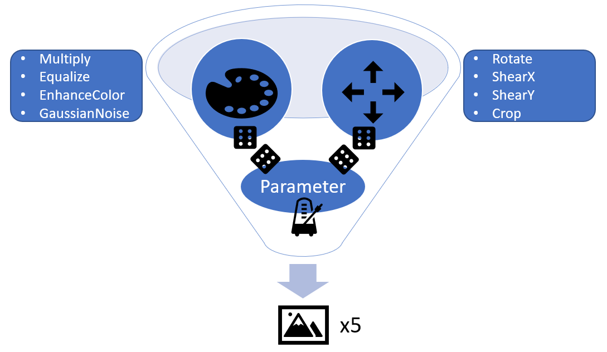
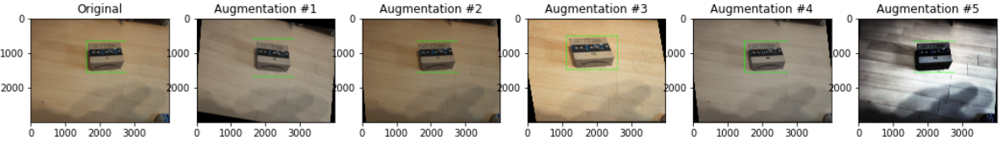

.. _sec:data-augmentation:

Data Augmentation
=================

*Written by Luca Deck*

Scientific Inspiration
+++++++++++++++++++++++++
In order to increase performance and avoid overfitting, we increased data volume and diversity by means of data augmentation. For this, we developed a function to automatically apply a randomized combination of image augmentations. One important prerequisite for our library choice was the consideration of our manual labels, i.e. bounding boxes and polygons.
Our augmentation "policy" is inspired by the findings from the paper `"Learning Data Augmentation Strategies for Object Detection" <https://arxiv.org/abs/1906.11172>`_  which identified optimal data augmentation strategies through learning algorithms. Based on these findings, the popular library `bbaug <https://github.com/harpalsahota/bbaug>`_ including 4 augmentation policies was published by Google's Brain Team. These policies each consist of a set of tuples representing a specific augmentation (e.g. Rotate and GaussianNoise). The actual augmentations are imported from the imgaug library.

Augmentation Script
+++++++++++++++++++++

Due to use case-specific considerations and compatibility issues with the bbaug library, we decided to come up with our own policy. Similarly to bbaug, we used `imgaug <https://github.com/aleju/imgaug>`_. First of all, our code is very flexible regarding kinds of augmentation, number of augmentation effects per augmented image as well as number of augmented images per raw image. Thus, the trial and error for different parameter combinations can be easily implemented.

Our function accesses the directory of raw images and its labels, goes through a number of augmentation iterations and saves the augmented images as well as the updated list of labels into a folder. Firstly, these augmentation effects are chosen randomly from the entire pool of specified augmentations. Secondly, the parameters for the augmentation effects are also chosen randomly from a specified interval. This way, we ensure a broad and randomized variety of effects without inducing overfitting hazards and without effect overload.
One augmentation iteration consists of two superficial "color augmentations" (Multiply, Equalize, EnhanceColor, AdditiveGaussianNoise) and two "geometrical" augmentations (Rotate, ShearX, ShearY, Crop). The selection of these effects and their parameters is the result of an extensive trial and error procedure across the imgaug library. For example, we removed a perspective transformation because it altered the bounding box "fit" too strongly and decided against. Also, we decided against a cutout feature which replaces pixel areas with random unicolor boxes because it was prone to entirely covering smaller damages.

The entire approach is depicted in the following framework:

Result
+++++++++
We went with 5-7 augmented images per raw image, so that we could increase our dataset from unique 756 images and *842* negative images to a total of *5162* images for training.

    
    Example augmented images.

Side Notes
+++++++++++++
Note that for simplicity reasons and time restrictions, we decided to transform the polygons into bounding boxes for the subsequent processing of the annotations. However, the implementation of polygons (and thus more precise labels) is theoretically possible with our augmentation script and only requires some adjustments. 
We also faced the challenge that some augmented labels are "out of range", e.g., when rotation leads to bounding box coordinates that are not within the actual image pixels. This issue is resolved in the training pipeline and not in the augmentation script.