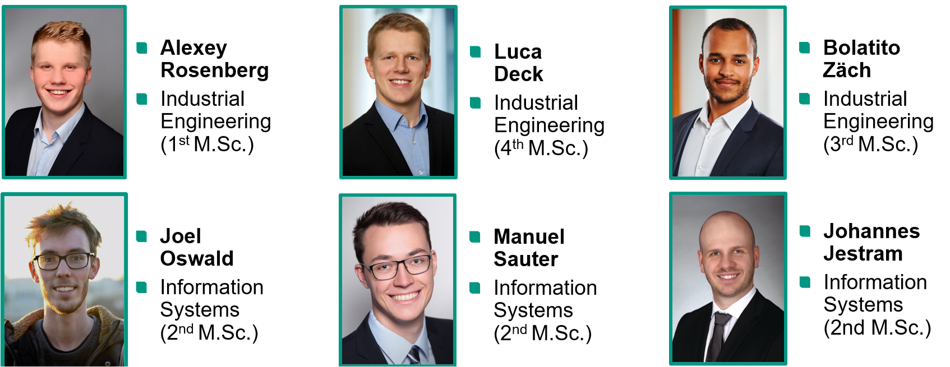
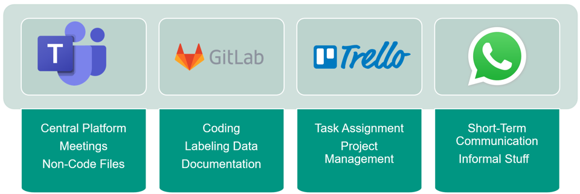

Collaboration
=============

*Written by Luca Deck*

This section introduces our group members and gives an overview about the tools we used for organizing our basic workflow.

Our Team
---------

Co-Working Environment
----------------------

- **MS Teams** We used Microsoft Teams as our central platform for weekly meetings. This is also where we shared our minutes of meeting and further non-coding related files like presentations.

- **SCC GitLab** The university's GitLab instance was our central platform for all coding related topics. The key activities here were version control, code documentation, and a series of short Readmes and tutorials for internal communication.

- **Trello** We used Trello as a project management tool and for task assignment. In every meeting we created tasks to solve upcoming challenges, assigned group members and highlighted important dates. This not only helped structuring the meetings and individual workload, but also ensured us meeting all the deadlines.

- **WhatsApp** Lastly, we used WhatsApp as a messenger for short-term communication and coordination (e.g., postponing meetings or discussing recent developments).