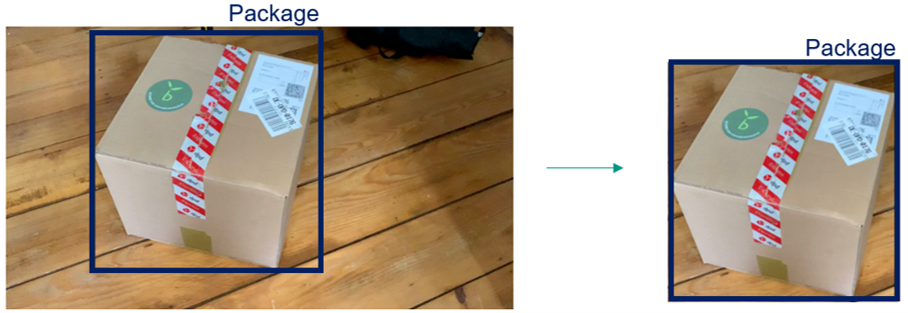

Outlook & Possible Enhancements
===============================

*Written by Luca Deck*

Real-Life Insights and Fine-Tuning for Productive Environment
-------------------------------------------------------------

We would have hoped to base our interpretations on real-life experiences from our industry partner. By tapping into the customer sphere and collaboratively designing our service, we would have been able to make at least two central adjustments. Of course, our model is open for such adjustments. Unfortunately, we missed out on the valuable information due to Corona restrictions. These two aspects also provide a crucial basis for future concept or model drift considerations.

Relevant Critical Properties
<<<<<<<<<<<<<<<<<<<<<<<<<<<<

Our list of critical properties (hole, dent, wet, open) is based on initial considerations. Talking with employees in the return order department of our industry partner would have revealed authentic insights into the real-life situation. In a short preliminary talk with the supervisor we learned that there are all sorts of damages and disfigurements one can imagine. For example, many packages are scribbled on heavily or strappings are damaged.
By updating and prioritizing the list of critical properties, one could adapt the training data set and prioritize it according to the respective damage frequency.

Interpretation of Critical Properties
<<<<<<<<<<<<<<<<<<<<<<<<<<<<<<<<<<<<<

Exchange with domain experts would have also enabled a more sophisticated interpretation logic. Information on which kind or which extent of damage usually leads to manual interventions could be implemented into the interpretation of the model output. For example, we imagine that a package with a giant hole usually should be filtered out while some minor dents are unproblematic. Concluding, this would reduce the number of warning messages to a relevant minimum and thus increase the operational efficiency of our overall system.

Two-Stage Model Architecture
----------------------------

One of our initial ideas was to implement an additional damage detection model that is applied to the identified bounding boxes to factor out the damage detection as a sequential step. In other words, as soon as a package would be identified by our "base model", the focal pixel coordinates would be rescaled and applied to the original image out so that the more complex damage analysis would be based only on the package itself. This way, for inference the model would be able to feed in the maximum of relevant pixels , hopefully increasing precision. Also, this would implicitly encode that damages can only occur on packages.
While we still perceive this as a promising approach, we had to leave it unattended due to its architectural complexity and expenditure of time. Also, the effects might be weakend by the low Jetson Nano resolution in the first place.

Implementation of Polygon Labels & Instance Segmentation
--------------------------------------------------------

Our model was initially planned to read in and process polygon annotations for the damages. However, due to time and computing power restrictions, we decided to go for the simple way and transformed them into bounding boxes. We assume that accounting for the more precise polygons would significantly increase mAP for the damages. Also, it would be valuable for instance segmentation which is a possible future enhancement but out of scope for this project.
At the same time it poses way more labeling effort and consumes more of the GPU's computing power. From a coding perspective, the data augmentation and the training pipeline would only need some minor adaptations. However, we would need to switch to `Poly-YOLO <https://gitlab.com/irafm-ai/poly-yolo>`_ or some segmentation model.

Deployment: Integration into a Warehouse Management System (WMS)
----------------------------------------------------------------

Finally, with regards to deployment, our service is perfectly suited to be integrated within a WMS and thus be embedded within a service system. By sharing a simple interface, the model output and the warning message could be transmitted to a control center functionality of a WMS. The control center receives the labeled image as well as an evaluation of the severeness which add up to a recommended action. The control center then decides whether the package has to be filtered out or even if the conveyor has to be stopped.
Moreover, for an even more complex application, our model might be integrated into the warehouse data stream. In combination with an object tracking functionality, our system would know at any time which package is being scanned for damages. Thus, the warning message could additionally contain information about the package (ID, origin, destination, client etc.) to facilitate decisions and enable data-driven subsequent analyses.

