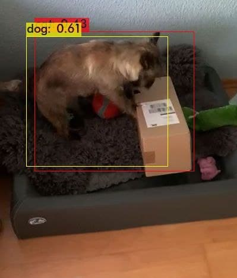

Timeline
============

*Written by Alexey Rosenberg*

This section covers the progress of this project in chronological order. 
For an overview of the project, we will first present a compressed timeline. 
Following the compressed version, a monthly timeline with detailed descriptions of the team activities is presented.

Brief Timeline
++++++++++++++

- **End of April:** Creating a team and brainstorming of ideas for use cases.
- **Beginning of May:** Definition of use cases and start of training data collection.
- **End of May:** End of training data collection, beginning of model prototyping, system architecture design and data augmentation definition.
- **Beginning of June:** First successes in model prototyping with Tensorflow and YOLO, continued data augmentation, successful testing of SSD on Jetson Nano
- **End of June:** Implementation of data augmentation script and creation of an augmented training data set, set-up of Microsoft Azure for online training, decision to continue development of both SSD and YOLO models until the end of the project, successful test of YOLO on Jetson Nano
- **Beginning of July:** Deployment of both models on Jetson Nano, evaluation and fine-tuning of model, appointment with company for validation of use case (canceled on short notice), prototype, and collection of real-life testing data, additional training data collection with static background
- **End of July:** Final training of YOLO, SSD with MobileNet and SSD with ResNet with newly collected data, final documentation, presentation of results and end of project
 
Detailed Timeline
+++++++++++++++++

April
-----

After team creation, the project began with brainstorming of possible use cases at the end of April. 
After a meeting with our supervisor the possible use cases were reworked, specified, and reconsidered. 

The teams decided on weekly sprints as workmode and the infrastructure of an IT project is set-up, such as a GitLab repository, Microsoft Teams for meetings and Trello for project management. 
Additionally, we researched availability of image data for the different proposed use cases.

May
---

By the 5th of May we chose the recognition of damages on packages as the use case.
The main arguments for the use case were the high practical relevance of the use case in logistics. 
As many, especially foreign, packages are often delivered with extensive damages, automated recognition of packages could reduce the number of personell necessary for quality management in package reception and shipping.
Additionally, the possibility of cooperation with a company for real-life  data and validation of the prototype at the company's premises were important arguments in the use-case decision.

A week later, on the 12th of May, we defined the common standards for training data collection up to this meeting and chose a tool for image annotation. 
Also, the to-be-detected types of damages were collaboratively defined, enabling the start of the training data collection phase.
 
For image annotation the `VGG Image Annotator <https://www.robots.ox.ac.uk/~vgg/software/via/>`_ was chosen. 
At least 50 images were expected from each team member resulting in 300+ images for training the models. 
We describe the training data collection in detail in section :ref:`sec:training-data-collection`. 

Further, the Erwin Müller Mail Order Solutions GmbH (EMMOS) was contacted by one of the group members to initiate talks for a possible cooperation, with the goal to collect training data in a "real-life" environment. 
This data was intended to be used to evaluate the model created on homemade training data and increase its applicability by using it in the final training of the model. We also hoped to gain valuable insights for our use case, for example, how often they receive complaints for damaged packages or how they usually handle damage detection.

We finished data collection by 19th of May. 
Initially, we wanted to save the training images on GitLab using LFS (Large File Storage), but this function is not supported by KIT's SCC. 
Therefore, we chose *BW Sync-and-Share* as an alternative for training data storage. 
Also, the training data collected by the different group members was checked for consistency and conformity to the predefined standards.

Next, we received the Jetson Nano hardware, set it up and tested it. 
To enable later deployment by all members of the group, a SSH access to the Jetson Nano was proposed. 
For documentation of the project a `Sphinx Python Documentation Generator <https://www.sphinx-doc.org/en/master/>`_ was chosen and added to the GitLab repository. 
Additionally, the model prototyping began with an overview of the different available models and a test of a pretrained model, as seen in the image below.
Lastly, we discussed and finalized the intermediate presentation.

	
	Example of first test inference on the team mascot.

June
----

During the following two weeks, we focused on testing different libraries for data augmentation and assessing the use of different object detection frameworks, namely YOLO and the Tensorflow Object Detection API. 
Regarding data augmentation, we analyzed different image augmentation libraries, such as *imgaug*, and the preprocessing capabilities included in Darknet and Tensorflow.
After analysis of the offered options and the augmentations necessary for our use case, we deemed the preprocessing capabilities included in Darknet and Tensorflow insufficient. Hence, we decided on using an additional library.
We defined a list of augmentations for the training data and created a set of augmented data. One of the major obstacles in data augmentation was the augmentation of the bounding boxes along with the images. 
Details can be found in section :ref:`sec:data-augmentation`.

Further, both object detection frameworks (Tensorflow, Darknet), were successfully implemented, resulting in working prototypes for both models. 
At first, we researched the possible integration of YOLO in the Tensorflow object detection API, in order to enable quick switching and evaluation of different detection models. Unfortunately, we did not find a viable implementation of YOLO in Tensorflow.
Therefore, the team decided on the parallel implementation of both frameworks, to later decide for one.
Further, we set up Microsoft Azure to enable online training of models. 
We also decided to begin writing the documentation.

On 23 of June, the data augmentation had been finished and a set of augmented training data was created for training. 
We successfully trained the SSD model online using Azure. 
Additionally, the team prepared the appointment at the company for a field test of the Jetson with one of the models and interviews with employees of the company.
Finally, we added an extensive number of negative examples to the training data set, to increase model performance.

July
----

A week later, the appointment with the company was cancelled due to COVID-19 restrictions. 
This was unfortunate, as we planned to validate the use-case and collect additional data for testing purposes.
YOLO model was successfully trained with all training data locally. 
We first discussed an outline of the application logic beyond pure object detection required for the use case. In particular, we discussed a functionality to notify the user about detected damages.
 
On the 14 of July, the user notifications were implemented using the `Pushover <https://pushover.net/api#attachments>`_ API. The user receives a notification and a labelled image, if a packages with damages is detected.
Further, the weights of the YOLO model and config file were converted to TensorRT for deployment on the Jetson Nano.
Due to the mediocre performance of all models, the team initiated a second round of training data collection with a static background.
The static background was intended to increase model performance and provide a closer resemblance for the intended use case with a static device above or besides a conveyor belt.

On the 21 of July, the second round on of training data collection was finished, i.e., taking, labelling and augmenting all new images.
We performed a final training of YOLO, SSD with MobileNet and SSD with ResNet on the new, augmented dataset.
Also, the project documentation and final presentation was finalized, leading to the end of the project.
