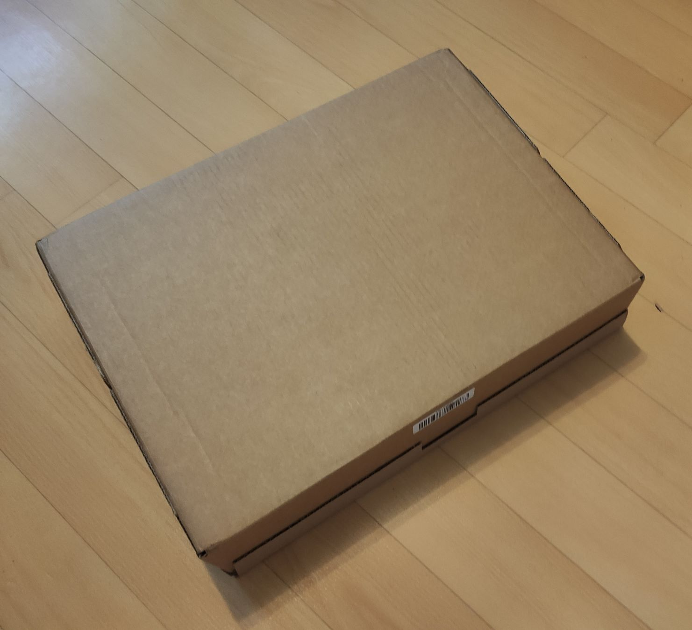
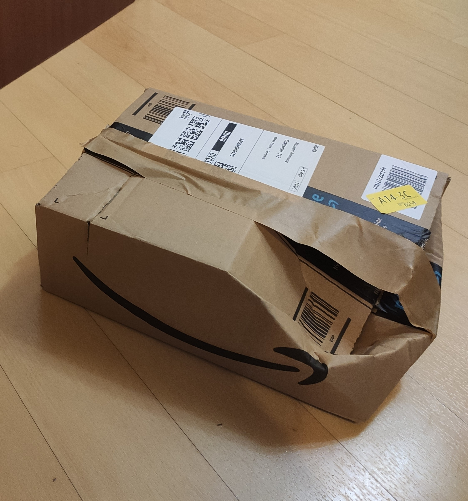
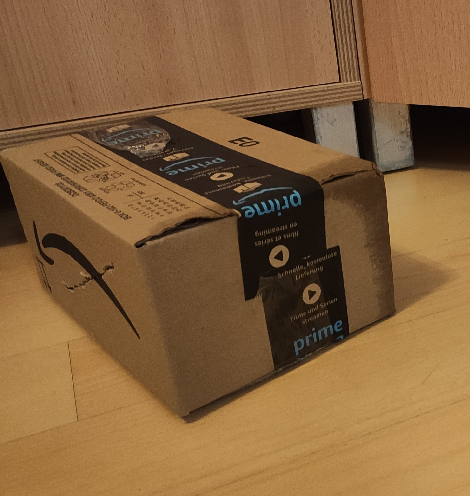
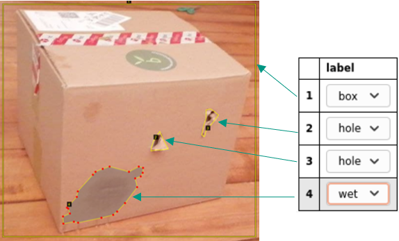

.. _sec:training-data-collection:

Training Data Collection
========================

*Written by Alexey Rosenberg*

We performed two rounds of training data collection, the first one being in May and the second one in July, towards the end of the project.
First, we give general information about the data collection.
Then the classes of damages are described in greater detail and examples are given.

Overall Information on the First Round of Training Data Collection
------------------------------------------------------------------

The task of collecting training data was shared among all team members. Each team member was tasked with finding several cardboard boxes and taking at least 50 images in a homemade environment. 

    Example training image.

The goal of collecting at least 300 training images was fulfilled and exceeded as most members provided more data than necessary. 
We deemed 300 unique images enough as this number can be further increased through data augmentation methods, as described in section :ref:`sec:data-augmentation`.

Classes of Damages
------------------

As the use case of the project is the identification of damages on cardboard boxes, 60% of the provided images contain damages on the depicted boxes and 40% depict boxes without damages.
The frequency of each damage class is defined to be about 25% to avoid class imbalance in the training data. We chose four classes of damages:

- Holes: Packages with holes or cuts in the sides or lid of the box
- Open: Packages with an open or insufficiently closed lid
- Dents: Packages with small- or large-scale dents or broken edges
- Wet: Packages with obvious damage from exposure to water

The following figures are examples of training images with different damages.

   
   Box with a dent. 

   
   Box with a hole and damage from water.
   
We discussed several further classes, such as overfull packages or packages with damaged labels. 
These additional classes were discarded mainly for reasons of simplicity in the initial development process, as they can be added at a later stage of development.

Standards and Tools for Training Data Collection
------------------------------------------------

To increase consistency among the collected training data, we defined standards for collection prior to the start of the collection process.
A mobile phone camera with an aspect ratio of 4x3 and a HD resolution of at least 1080p was sufficient for our use case. 
While most object detection frameworks work with a resolution of 300x300px, we chose a higher resolution to enable later down-scaling and cropping of images, without the loss of necessary resolution.
Additionally, all team members named their images distinctly to enable unique identification of the training data.

Image Annotation
----------------

For image annotation we chose the `VGG Image Annotator <https://www.robots.ox.ac.uk/~vgg/software/via/>`_. 
The main arguments for the use of the tool were it being open-source and free of charge. Additionally, the tool and its functionality were presented in the lecture, hence all team members were familiar with its functionality. 

For annotation we defined the boxes to be annotated using rectangles, while the different damages were annotated by polygons. 
The use of different annotation types was decided to balance workload for the annotation against future prediction precision.
As damages are often small scale and difficult to distinguish from the boxes, the finer, polygon annotation method was initially chosen.
Multiple :ref:`helper functions <utils_reference>` are created to handle and convert label types.

Later in the project, we converted the polygons used in this first annotation to rectangles, as the used models are not able utilize polygon annotations.

	
	   Example of annotations of box and damages.

End of First Round of Training Data Collection
----------------------------------------------

At the end of the data collection phase, we reviewed our dataset to avoid bias and check for consistency of labeling among all team members.
Explicitly, we reviewed a correlation between the presence and the number of damages, to check if the presence of one type of damage implied the presence of another type of damages, either a random or a specific type. 
Such correlation was not found among the data after a review with random sampling of the training data.
 
We stored the training data on BW Sync-and-Share, as the GitLab instance of the SCC does not support the use of LFS (Large File Storage) at this point. 
The Pascal VOC exports of the labels reside were stored in the GitLab repository.

.. _sec:additional-training-data-collection:

Additional Phase of Training Data Collection in July
----------------------------------------------------

Due to deficits in the training data collected in the first round and the mediocre performance of all models, we decided on collecting additional training data.
This time, we used a static background, as this should increase model performance and provide a closer resemblance for the intended use case.
To provide a more homogeneous set of images, we solely used the Jetson Nano camera. This way, we could reduce the differences between the images taken with our own cameras and the data the Jetson performs inference on in production.
In this round, we collected *230* images with the Jetson Nano, thus resulting in a total of *720* unique, un-augmented images for augmentation and subsequent training.

Additionally, we added *842* images of negative examples, such as images of household floors, grass, and pathways, to the training set.

This led to a total of *5162* images (including all augmented images and negative examples) to be used for our final model trainings.
