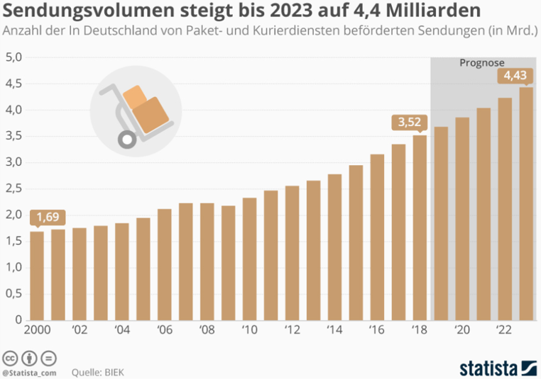
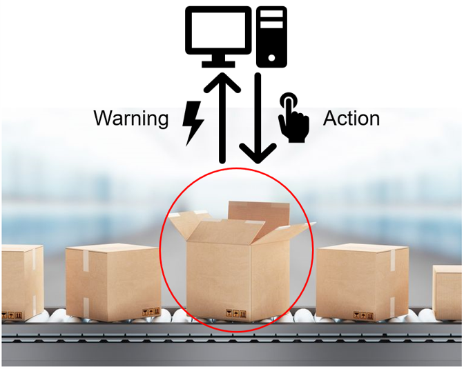
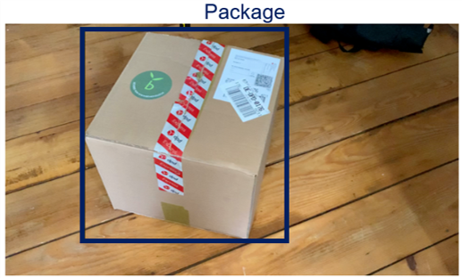
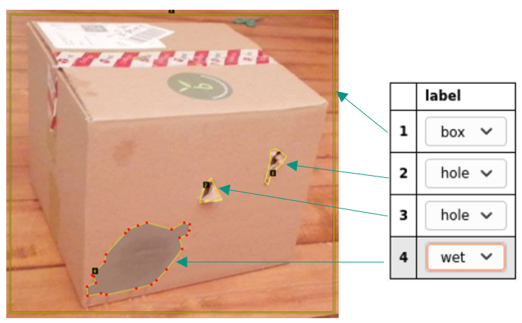
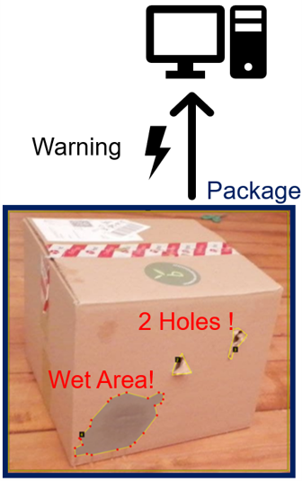

Use Case
========

*Written by* Luca Deck

Problem Setting
---------------

With online trade becoming more and more popular, the number of shipments (in Germany alone) rose to more than **3.5 billion** in 2018, expected to reach 4.4 billion in 2023. Handling this immense daily volume requires logistics and **distribution centers** to consistently increase efficiency while maintaining a sufficient level of quality. 
One crucial detrimental factor in this context are **damaged or unsealed packages**. Primarily, for **quality control** and customer satisfaction intensive and expensive **manual effort** is required in order to evaluate the intactness of outgoing shipments. Moreover, if not identified in time, they can cause interruptions and traffic jams within the material flow.

Source: [#]_

Real-Life Value
---------------

We want to resolve this issue by implementing an **automated warning system** for logistics or distribution centers that informs the control center, whenever some quality specification of a package is violated. This can be set up and used in receiving areas, before shipping or basically everywhere within the supply chain. In this sense it might also be of interest for package delivery services like DHL, Hermes etc. to avoid handing out corrupted parcels.
Our computer vision model firstly **detects packages** and secondly **localizes and classifies critical areas of a package**. The picture including the critical information is immediately transmitted to the control center to intervene and resolve the issue in time. This way, quality of packages within a flow system can be guaranteed and corrupted packages can be filtered out quickly while saving **manual effort**.

For collecting training data and providing a proof of concept, we organized a cooperation with an industry partner who operates a distribution center and is confronted with all sorts of critical packages every day. Unfortunately, due to Corona restrictions, our visit to their logistics center had to be cancelled at short notice.

General Approach
----------------

Step 1: Identifying Packages
++++++++++++++++++++++++++++

First of all, our object recognition model should identify cardboard packages within the entire image. This a quite simple task for modern object recognition applications and provides the basis for subsequent analyses.

Step 2: Localizing and Categorizing Critical Areas
++++++++++++++++++++++++++++++++++++++++++++++++++

Within the bounding box of identified packages, our object recognition model further aims to localize and categorize critical areas indicating violations of a quality specification. For our use case we decided to focus on four different critical properties:

+ Holes
+ Dents
+ Wet areas
+ Unsealed

We claim that these properties are potential threats within the material flow (e.g. content spill-out) and primarily responsible for superficial quality insufficiencies (e.g. customer complaint about damaged package). However, this list is not comprehensive and can be adjusted depending on the specific use case.

Step 3: Interpretation and Warning Message
++++++++++++++++++++++++++++++++++++++++++

Finally, based on this information, we want to come to reasonable conclusions for the control center. If some critical criterion is fulfilled (e.g. unsealed) or the extent or sum of damages is concerning (e.g. giant hole), the system sends out a warning message to the control center in real-time. This message includes the picture as well as the potentially critical areas. Within seconds, the control center can evaluate the image and initiate an intervention (e.g. stopping the conveyor or filtering out the package) to manually handle the problem. 
In our project, we simulated the message forwarding by transmitting the information to a mobile application.

.. rubric:: Image Sources

.. [#] https://de.statista.com/infografik/9992/in-deutschland-von-den-paket-und-kurierdiensten-befoerderten-sendungen/